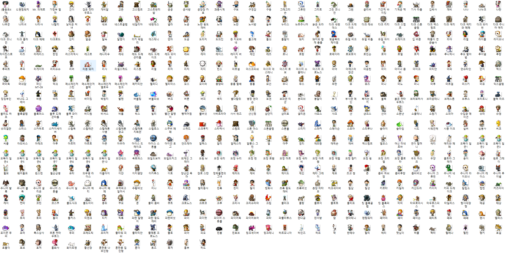
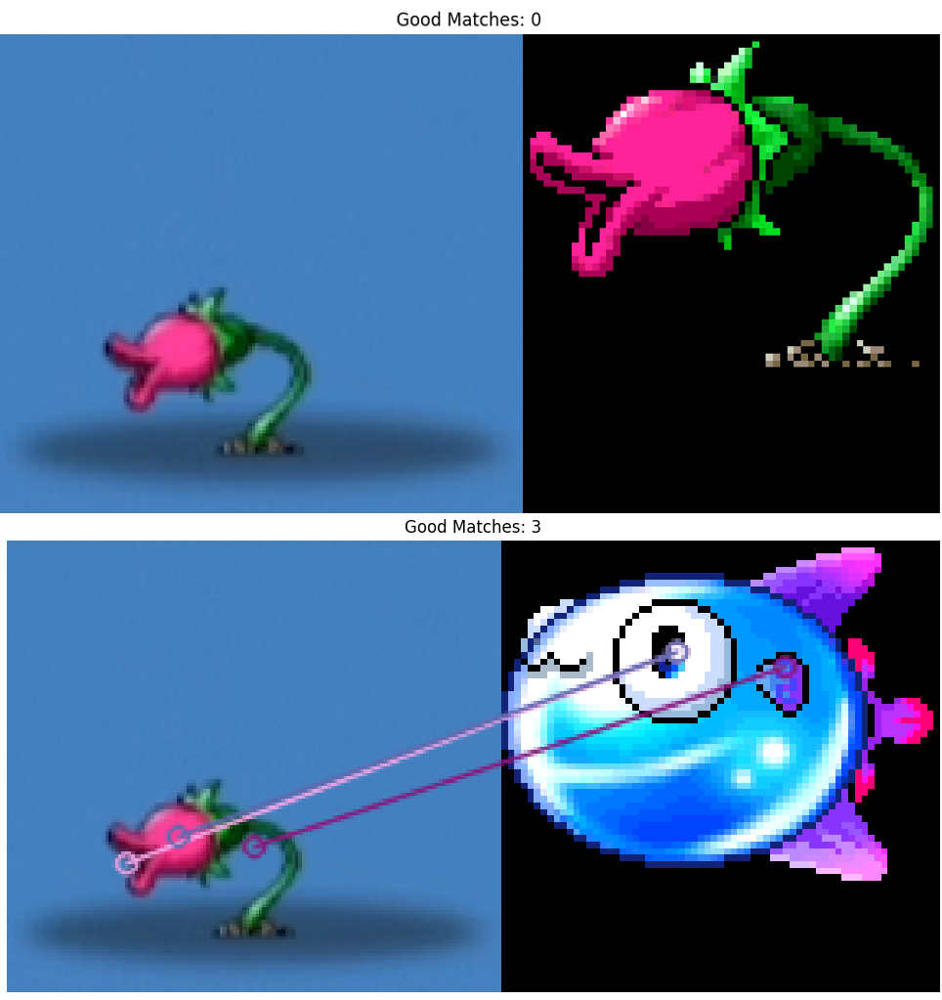

# Real-Time Screen Image Matcher (SIFT-based)

## Motivation

In an online game, there was a timed event where players had to identify NPCs quickly.
As a beginner who didn't recognize any of them, I built this tool to automatically analyze
what appears on the screen and find the most similar image from a set of known characters.

This project solves a real problem by combining computer vision and real-time interaction.

To build the reference dataset, I crawled and downloaded over 500 NPC images from the game's online community.
Since manually identifying them during the quiz was nearly impossible, automating the recognition process became essential.

This project solves a real problem by combining computer vision and real-time interaction.
---

## Features

- Real-time screen capture & image similarity matching
- SIFT-based feature detection and matching
- Feature caching to `.npz` for performance
- GUI overlay to visualize capture region (Tkinter)
- Unicode path support
- Multithreaded processing (UI + matching)

---

## Project Structure

```
project-root/
├── images/             # Input reference images (ignored in git)
├── savedData/          # Saved feature files (.npz) (ignored in git)
├── image_Processer.py  # Real-time feature matcher
├── preprocessing.py    # Feature extraction script
├── ui.py               # UI capture window overlay
└── main.py             # Entry point: initializes extraction + threads
```

### used images



---

## Requirements

- Python 3.8+
- OpenCV (`opencv-python`)
- Pillow
- pyautogui
- tqdm
- keyboard

### Install all dependencies:

```bash
pip install opencv-python pillow pyautogui tqdm keyboard
```

---

## How to Use

1. Add images  
   Put your reference `.jpg` / `.png` images into the `images/` folder.

2. Run the main script

```bash
python main.py
```

- If `savedData/` does not exist, or the number of `.npz` files doesn't match the number of images, feature extraction will run automatically.
- A semi-transparent red box will appear; move it over your screen to define the matching area.
- The script will display the top 7 matching images in a popup window.
- Press `Enter` key to exit.

---


## Logic Summary

- `main.py` handles initial checks and starts threads for:
  - `image_Processer.main_loop()` for continuous screen capture & matching
  - `UI.show_capture_window()` for visual capture overlay
- `preprocessing.py` extracts features using SIFT, ORB, BRISK, AKAZE (though only SIFT is used in matching).
- Matching is based on descriptor similarity using Lowe's ratio test.

## Demo


> At first launch, all reference images are processed to extract features.  
> In the demo, this was ~500 images — but the system is capable of handling much larger datasets efficiently.


> Every 0.5 seconds (default), the screen within the red capture box is analyzed.  
> The system compares it with the reference image dataset and shows the **top 5 most similar images** in real-time.


The system is capable of finding accurate matches even when the selected region (red rectangle) does not completely enclose the target image.


## Limitation



Although the two images clearly show the same flower-type monster, SIFT produced only 1–2 good matches.
Surprisingly, an unrelated blue fish character yielded more matches (2–3), despite being visually and semantically different.

#### Possible reasons:
- **Lack of texture** — smooth surfaces produce fewer detectable features  
- **Rotation and scale difference** — can reduce match quality despite invariance  
- **Background interference** — affects gradient patterns near object edges


## Evaluation
Across multiple trials involving 50 distinct characters, it successfully matched more than **45 out of 50** cases on average — even under minor variations in rotation, scale, or lighting. For future robustness, hybrid approaches or learning-based methods may help overcome these limitations.


## Future Improvements
- Combine results from multiple detectors (e.g., SIFT, ORB, AKAZE) to calculate an aggregated match score
  - Improve robustness by fusing results from different algorithms
- Improve matching accuracy using machine learning
  - Train a lightweight image classifier (e.g., MobileNet) to predict the best match
  - Combine SIFT-based ranking with model-based validation
- Enable user feedback loop to retrain with misclassified data
- Provide a simple web service (Flask or FastAPI) to expose the matching system
  - Upload screen captures and receive top-N matched images as response
  - 
---
